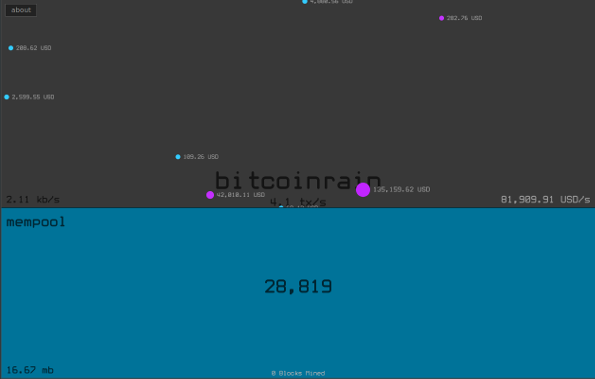
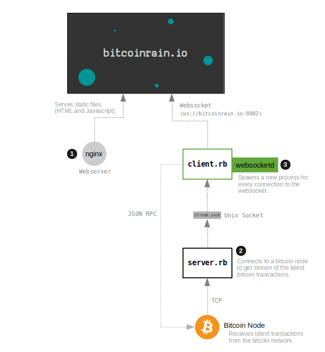

# BitcoinRain.io

A **visualisation** of bitcoin transactions as rain. Each raindrop is a _realtime bitcoin transaction_.

You can check out the live transaction stream websocket server at `[http://bitcoinrain.io:8082](http://bitcoinrain.io:8082)` (click the tick), or connect to it directly from your program at `ws://bitcoinrain.io:8082`.

[](http://bitcoinrain.io)

## About

This is my first attempt at making a realtime visualisation website using **Websockets**. It works by:

1. Connecting to a running [Bitcoin Core](https://bitcoin.org/en/bitcoin-core/) node to get recently broadcast bitcoin transactions.
2. Running [websocketd](https://github.com/joewalnes/websocketd) to use that data in a websocket server.
3. Using [p5.js](https://p5js.org/) to visualise the data on a webpage.


## Dependencies

### Ruby

The backend stuff is written in Ruby. This is essentially a script that connects to a Bitcoin Core client to get live transaction data.

```
sudo apt install ruby # I'm currently using Ruby 2.5+
```

### PHP

The decoders for the raw bitcoin [transaction data](http://learnmeabitcoin.com/glossary/transaction-data) are written in PHP. I would have written them in Ruby, but I already had a reliable decoder written in PHP, so I just used that instead.

```
sudo apt install php7.3      # first time using 7.3 :)
sudo apt install php7.3-gmp  # Gnu Multiple Precision (needed for bitcoin library stuff)
```

### [websocketd](https://github.com/joewalnes/websocketd)

This is a cool tool written in [Go](https://golang.org/) that turns any program's STDOUT in to a websocket server.

```
sudo apt install golang-go # websocketd is built in Go
set -U -x GOPATH $HOME/.go  # Set GOPATH (Fish Shell)
export GOPATH=$HOME/.go     # Set GOPATH (Bash Shell - add this to .bashrc to make permanent)

# websocketd
go get -u github.com/joewalnes/websocketd  # Binary will be in: ~/.go/bin/websocketd or ~/go/bin/websocketd
```

### [p5.js](https://p5js.org/)

The visualisation in the browser uses a JavaScript library called p5.js, which is awesome. These libraries are in the `assets/js/` folder.

```
assets/js/p5.js         # main library
assets/js/p5.min.js     # minified version loads much faster

assets/js/p5.dom.js     # add on for creating and working with dom objects
assets/js/p5.dom.min.js
```


## Running

### 1. Webserver

First of all, you need to use set up a webserver to serve the `index.html` page (and all the javascript files in the project root). I'm using [nginx](https://nginx.org/), and something along these lines in my `nginx.conf`:

```
http {
    server {
        listen 80;
        location / {
            root /home/user/projects/bitcoinrain/;
        }
    }
}
```

Then reload nginx to use the new configuration with:

```
sudo nginx -s reload
```

The website should now be working at `http://localhost:80`.

However, the webpage will be receiving data from my remote websocket hosted at `ws://bitcoinrain.io:8082`. If you want to _run your own local websocket server_, you will need the do the following:

### 2. Connect to a Bitcoin Node

Run `/server-ruby/server.rb`, which connects to a Bitcoin Node to get the latest bitcoin transactions:

```
cd server-ruby/
ruby server.rb
```

_**NOTE:** You can change the IP of the bitcoin node you want to connect to by editing the the `bitcoin_node` variable at the top of `server.rb`._

### 3. Websocket Server

Finally, you need to run `websocketd` to start the websocket server. This will **spawn a `client.rb` process every time a connection is made to the websocket** server at `ws://localhost.io:8082` (so every time someone visits the website). To get this running, open _another_ terminal and run the following:

```
cd server-ruby/
bash websocketd.sh
```

_**NOTE:** You can change the port the websocket runs on by changing the `--port` option in `websocketd.sh`. The default is `8082`._

_**NOTE:** You should also change the `websocket_uri` variable in `index.js` from `ws://bitcoinrain.io:8082` to `ws://localhost:8082` to connect to this new socket._

## Architecture



**1. Webserver** - This serves the HTML and Javascript files for the website. I like nginx, but I'm sure you can use any webserver. The javascript code in `/index.js` wants to connect to a websocket at `ws://localhost:8082` for receiving transaction data.

**2. `/server-ruby/server.rb`** - Connects to a bitcoin node so that it can receive the latest transactions from it. It then uses the PHP scripts in `/decoders` (because I already had transaction decoders written in PHP) to decode the raw transaction data in to JSON, and writes the decoded transaction JSON data to a UNIX socket file `stream.sock`.

**3. `/server-ruby/client.rb`** - Spawned when a connection is made to the websocket at `ws://localhost.io:8082` (courtesy of [websocketd](https://github.com/joewalnes/websocketd)). This script connects to `stream.sock`, and reads all the data that is written to it by `server.rb`.

In other words, `server.rb` is the single source of data, and `client.rb` is a lightweight process that is spawned by _websocketd_ to read from it.

### Directory Structure

```
$ tree --dirsfirst -FnL 1
.
├── assets/          <- p5.js and font
├── docs/            <- documentation/diagrams
├── server-ruby/     <- websocket server
├── server-php/      <- websocket server (alternative)
├── Ball.js          |
├── Blockchain.js    |
├── Block.js         |
├── Donations.js     | <- main website visualisation
├── index.html       |
├── index.js         |
├── Mempool.js       |
├── LICENSE
├── README.md
├── robots.txt
```

### Notes

* The `/server-ruby/server.rb` is a script that makes a TCP connection with an actual node so that it can receive transactions from it. You could avoid having to do this low-level TCP connection stuff by using an existing websocket as a data source, or get the latest transactions from a node by using the [ZeroMQ](https://github.com/bitcoin/bitcoin/blob/master/doc/zmq.md) feature instead.
* I wrote another script to connect to a Bitcoin Node in PHP, which can be found in `/server-php/`. This does the same job as `/server-ruby/`, but it's a backup in the event that the Ruby script doesn't turn out to be reliable for whatever reason. You can switch to using the PHP version by replacing steps **1** and **2** with:

```
# terminal 1
cd server-php/
php server.php
```

```
# terminal 2
cd server-php/
bash websocketd.sh
```

## Thanks

* [Daniel Shiffman](https://www.youtube.com/user/shiffman) taught me everything I know about using [p5.js](https://p5js.org/). An amazing teacher who makes it easy to learn about programming in a fun way.
* [Joe Walnes](https://github.com/joewalnes) makes creating websocket servers easy with [websocketd](https://github.com/joewalnes/websocketd). His tool allows you to write a program in any language and use it's STDOUT as a websocket server. I **highly recommend** trying it if you're planning on using websockets in your next project.
* [BitListen.com](https://www.bitlisten.com/) was an inspiration in my decision to make a visualisation of live bitcoin transactions. I believe this was one of the first websites of its type.
